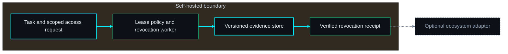
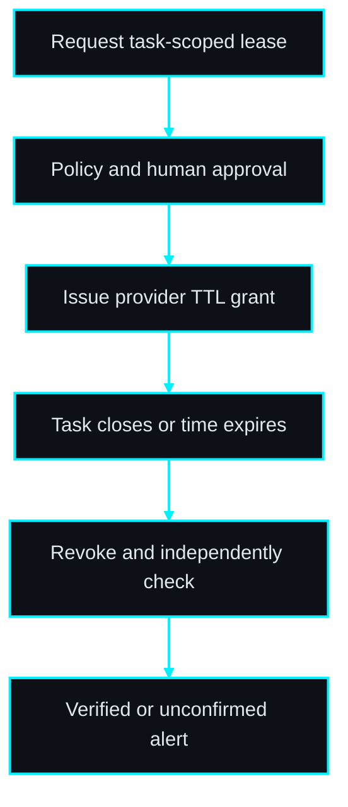
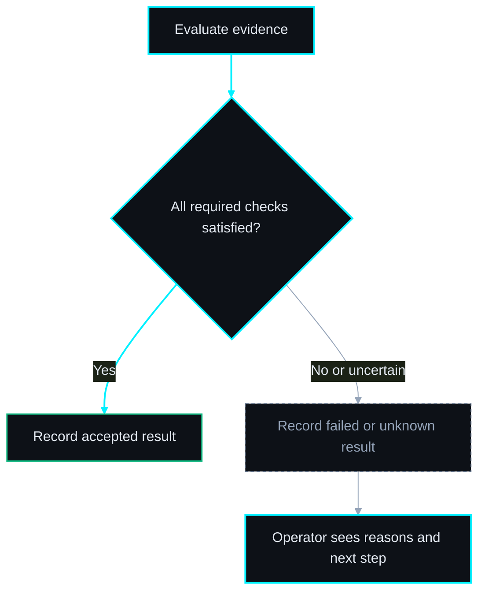

# PRD: AccessLease

**Make temporary task access expire—and prove revocation.**

Author: Codex via prd-writer · 2026-09-29

Status: Draft; proposed topology; open-source direction; implementation not started. Board: #3793 (authoring only).

## 1. Problem Statement

Temporary access becomes permanent because issuance, task completion and revocation live in different systems. An expired label is often mistaken for revoked access.

**Primary user / buyer:** Operators granting service access to contractors and automation agents.

**Evidence status:** product hypothesis from ecosystem operational pain, not validated demand. No competitor absence or willingness-to-pay claim is made. Before building beyond a synthetic prototype, interview three prospective users, capture five recent examples and compare the proposed workflow with their current tools.

## 2. Goal

Issue one narrowly scoped provider grant with a hard expiry, then independently verify revocation and retain a redacted audit receipt.

**Position in the ecosystem:** ReadyToStart validates prerequisite access. AccessLease manages grant lifecycle. It is not an identity provider or a general secrets vault.

**Open-source boundary:** the complete deterministic MVP, schemas, synthetic examples, test harness and operational documentation belong in the public source release. Self-hosting must not require a license server or private fleet service. Hosted operation/support is a possible later business model; willingness to pay must be tested. License and product-name clearance remain owner decisions before publication.

## 3. Non-Goals

Root/admin grants; universal IAM; browser session interception; emergency break-glass access; promising instantaneous revocation across cached sessions.

No sibling product is a mandatory runtime dependency. No repository creation, implementation dispatch, production mutation, merge or deployment is authorized by this PRD authoring task. AI-generated prose cannot substitute for test evidence or operator approval.

## 4. Success Metrics

| Metric | Baseline collection | Pilot target | Evidence |
| --- | --- | --- | --- |
| Baseline completion | Before first pilot: time five current manual workflows and record errors | Five usable baseline records per pilot team | Dated operator worksheet |
| Unverified overdue grants and operator time per temporary grant | Use the same scenario class and record sample size | Zero overdue grants marked verified without proof; at least 50% less operator time in 20 sandbox leases | Raw timestamps and outcome receipts |
| Activation | Record starting user count in the pilot | Three teams complete a synthetic core workflow within 30 minutes of install | Opt-in operator reports |
| Retention / value | Ask whether current workflow is still used after four weeks | Two of three teams elect to continue using the tool | Interview with concrete saved-time examples |

Targets are proposed decision thresholds. Report failures and sample sizes; small pilots do not establish market demand. Stop expansion if the baseline shows no recurring pain or existing tools solve it sufficiently.

## 5. Acceptance Criteria

- [ ] **AC-01** — Reject wildcard/admin scopes and TTL over the policy maximum; default one hour and hard maximum eight hours are configurable only by admins.
- [ ] **AC-02** — Bind approval to exact subject, resource, scopes and expiry; changed request or expired approval cannot issue access.
- [ ] **AC-03** — Require provider-enforced TTL; issuing uncertainty enters ISSUE_UNKNOWN and reconciliation, not duplicate grants.
- [ ] **AC-04** — On expiry or task closure request revocation within 30 seconds under healthy conditions; verify with provider introspection or denied-use probe.
- [ ] **AC-05** — Provider outage leaves REVOCATION_UNCONFIRMED with next retry and visible warning; it never displays a green revoked state.
- [ ] **AC-06** — After scheduler downtime sweep overdue grants before issuing new ones; retries identify the same provider grant.
- [ ] **AC-07** — Sandbox tests verify allowed access during lease, denied access after expiry and explicit revocation, including the chosen provider cache/session behavior.
- [ ] **AC-08** — A synthetic demo works without paid accounts or mandatory telemetry; an outbound-denied test completes the deterministic local core. Live connector operations fail explicitly when disconnected.
- [ ] **AC-09** — Validate size and schema before processing; planted secret tokens never appear in logs or exported reports; malicious HTML renders as text.
- [ ] **AC-10** — Export a versioned evidence bundle and restore/read it in a clean installation with matching hashes; truncated or unsupported exports fail without partial accepted state.
- [ ] **AC-11** — Release documentation includes installation, upgrade, backup, restore and failure diagnosis; a fresh operator can execute the synthetic smoke procedure.
- [ ] **AC-12** — Enforce workspace membership and admin/operator/viewer roles on reads, writes, jobs and exports; cross-workspace object IDs return 404 with no state change.
- [ ] **AC-13** — Worker restart reclaims leased jobs without discarding uncertain external outcomes; failed migrations stop readiness and a restored backup preserves references.

## 5b. Test Strategy

**SEC · 04c — Test Strategy & DoD**

**13 mapped ACs / 13 total ACs. All tests are PLANNED; none is claimed to pass.**

| AC | Level | Proven by — planned behavior | Execution | Status |
| --- | --- | --- | --- | --- |
| AC-01 | Unit + integration / E2E | `tests/accesslease.spec.ts :: <scope and TTL policy>` — assert the criterion, including its failure boundary. | Automated; live sandbox gated | PLANNED |
| AC-02 | Unit + integration / E2E | `tests/accesslease.spec.ts :: <approval freshness>` — assert the criterion, including its failure boundary. | Automated; live sandbox gated | PLANNED |
| AC-03 | Unit + integration / E2E | `tests/accesslease.spec.ts :: <native TTL and issue ambiguity>` — assert the criterion, including its failure boundary. | Automated; live sandbox gated | PLANNED |
| AC-04 | Unit + integration / E2E | `tests/accesslease.spec.ts :: <expiry and closure>` — assert the criterion, including its failure boundary. | Automated; live sandbox gated | PLANNED |
| AC-05 | Unit + integration / E2E | `tests/accesslease.spec.ts :: <revocation outage>` — assert the criterion, including its failure boundary. | Automated; live sandbox gated | PLANNED |
| AC-06 | Unit + integration / E2E | `tests/accesslease.spec.ts :: <restart sweep>` — assert the criterion, including its failure boundary. | Automated; live sandbox gated | PLANNED |
| AC-07 | Live sandbox + integration | `tests/accesslease.spec.ts :: <real denial proof>` — assert the criterion, including its failure boundary. | Automated; live sandbox gated | PLANNED |
| AC-08 | Unit + integration / E2E | `tests/accesslease.spec.ts :: <offline demo>` — assert the criterion, including its failure boundary. | Automated; live sandbox gated | PLANNED |
| AC-09 | Unit + integration / E2E | `tests/accesslease.spec.ts :: <redaction and hostile input>` — assert the criterion, including its failure boundary. | Automated; live sandbox gated | PLANNED |
| AC-10 | Unit + integration / E2E | `tests/accesslease.spec.ts :: <portability and corruption>` — assert the criterion, including its failure boundary. | Automated; live sandbox gated | PLANNED |
| AC-11 | Human + E2E | Non-builder follows supplied runbook in a fresh sandbox; record all assistance, step outcomes and cleanup receipt (§9 independent drill). | Human receipt + harness | PLANNED |
| AC-12 | Unit + integration / E2E | `tests/accesslease.spec.ts :: <workspace isolation>` — assert the criterion, including its failure boundary. | Automated; live sandbox gated | PLANNED |
| AC-13 | Unit + integration / E2E | `tests/accesslease.spec.ts :: <restart and restore>` — assert the criterion, including its failure boundary. | Automated; live sandbox gated | PLANNED |

### Flow and failure coverage

| User-facing flow | Happy path | Sad path / boundary |
| --- | --- | --- |
| scope and TTL policy | Reject wildcard/admin scopes and TTL over the policy maximum; default one hour and hard maximum eight hours are configurable only by admins. | Inject the rejected/uncertain condition in this criterion; assert no accepted result or unauthorized state change. |
| approval freshness | Bind approval to exact subject, resource, scopes and expiry; changed request or expired approval cannot issue access. | Inject the rejected/uncertain condition in this criterion; assert no accepted result or unauthorized state change. |
| native TTL and issue ambiguity | Require provider-enforced TTL; issuing uncertainty enters ISSUE_UNKNOWN and reconciliation, not duplicate grants. | Inject the rejected/uncertain condition in this criterion; assert no accepted result or unauthorized state change. |
| expiry and closure | On expiry or task closure request revocation within 30 seconds under healthy conditions; verify with provider introspection or denied-use probe. | Inject the rejected/uncertain condition in this criterion; assert no accepted result or unauthorized state change. |
| revocation outage | Provider outage leaves REVOCATION_UNCONFIRMED with next retry and visible warning; it never displays a green revoked state. | Inject the rejected/uncertain condition in this criterion; assert no accepted result or unauthorized state change. |
| restart sweep | After scheduler downtime sweep overdue grants before issuing new ones; retries identify the same provider grant. | Inject the rejected/uncertain condition in this criterion; assert no accepted result or unauthorized state change. |
| real denial proof | Sandbox tests verify allowed access during lease, denied access after expiry and explicit revocation, including the chosen provider cache/session behavior. | Inject the rejected/uncertain condition in this criterion; assert no accepted result or unauthorized state change. |

### Fixtures and runners
Use deterministic UTC clocks, synthetic IDs and planted fake secrets. Default tests cannot access customer accounts. Unit tests cover decision rules and state boundaries. Integration tests exercise real persistence and adapters against controlled fixtures; browser tests exercise API-backed UI rather than route mocks. For a CLI, E2E invokes the packaged executable in a fresh temporary directory and checks exit codes plus report contents. Add a static-report browser smoke for escaping, readable tables and empty/error states.

Each service module requires meaningful normal, invalid and boundary cases; each API router requires success, authorization and conflict tests. Each implemented page receives an E2E smoke and render tests for loading, empty and failure. Target at least 90% branch/line coverage of new decision and service code, with exclusions documented. Coverage is supporting evidence, not a substitute for the matrix.

Live adapters need opt-in sandbox tests pinned to provider/version and sanitized evidence. If credentials or a supported provider are absent, mark BLOCKED; mock success does not satisfy a live criterion. A seeded mandatory failure must turn the release verdict red. QA reconciles planned behavior labels to real test IDs in the implementation PR.

The final receipt records every repository SHA, dirty-tree status, environment, command, exit code, run time, fixture version, artifact hashes, skipped tests and unresolved findings. Any required NOT RUN, PARTIAL or BLOCKED row prevents a claim that the matrix passed.


## 5c. Definition of Done

Reference the canonical **CLAUDE.md → Quality Gate Standard (ALL repos)** at implementation time; resolve its actual workspace path in the build handoff and follow the current local/swarm runner policy. Do not introduce a competing universal gate in this PRD.

Feature-specific release conditions: every numbered acceptance criterion has current evidence; live criteria have live sandbox receipts; independent review of the final tested revision has zero P0/P1; seeded negative controls fail as intended; documentation explains unknown/partial states. Provider TTL and revocation semantics differ; cached access may outlive a grant. The chosen provider contract must define and test the maximum residual-access window.

This document is a requirements draft, not an implementation or release receipt.

## 6. Technical Spec

### Proposed architecture

TypeScript API and worker, PostgreSQL, React lease view. Provider TTL is the safety backstop. Credential delivery is one-time through a scoped authenticated retrieval endpoint; never in URLs, browser storage, logs or webhooks.

#### ◇ Diagram — Architecture
*The core works independently; adapters are optional.*



> **THE POINT:** The core works independently; adapters are optional.

#### ◇ Diagram — Workflow
*Persist evidence at each boundary; unresolved outcomes remain visible.*



> **THE POINT:** Persist evidence at each boundary; unresolved outcomes remain visible.

#### ◇ Diagram — Acceptance decision
*Completion and acceptance are separate; uncertainty cannot become success.*



> **THE POINT:** Completion and acceptance are separate; uncertainty cannot become success.


### Data model

leases(id UUID, workspace_id UUID, task_ref TEXT, subject_ref TEXT, resource_ref TEXT, scopes JSON, expires_at UTC, policy_hash TEXT, state ENUM); approvals(id UUID, lease_id UUID, actor_id UUID, plan_hash TEXT, expires_at UTC); provider_grants(id UUID, lease_id UUID, provider_ref TEXT, issued_at UTC, revoked_at UTC); revocation_attempts(id UUID, lease_id UUID, attempted_at UTC, result ENUM, verification_ref TEXT); audit_events(id UUID, lease_id UUID, actor_ref TEXT, action TEXT, occurred_at UTC)

Use schema_version on serialized documents, UUID primary IDs, UTC timestamps and content hashes over a documented canonical JSON encoding. Scope child references to their parent/workspace and enforce foreign keys. Index parent IDs, state and due timestamps. Append attempts and evidence; do not overwrite history to hide failures. Retain redacted evidence 90 days by default, configurable by operator; primary deletion completes within 24 hours and rotated backups expire within 30 days. The production operator must approve these defaults before customer data ingestion.

### Interface contract

`POST /api/v1/leases {task_ref,subject_ref,resource_ref,scopes,expires_at}` -> 201 `{id,state:"requested",plan_hash}`. `POST /leases/{id}/approve {plan_hash}` -> 202. `POST /leases/{id}/revoke {reason}` -> 202. `GET /leases/{id}` -> 200 `{state,expires_at,last_verified_at,revocation_status}`; overlong/privileged scope -> 422; stale approval -> 409.

HTTP routes use the `/api/v1` prefix throughout, including abbreviated routes above. Errors are `{error:{code,message,request_id}}`: 400 malformed input, 401 unauthenticated, 403 forbidden action, 404 inaccessible object, 409 version/idempotency conflict, 413 oversize payload, 422 schema/policy rejection, 429 rate limit, 503 dependency unavailable. Lists cap at 100 entries with cursor pagination. Request and response schemas ship in the repository.

For daemon products, local admin bootstrap uses a CLI and no default password. Sessions are revocable HttpOnly cookies with CSRF protection; authorization applies to every query, worker job and download. Admin manages policies/connectors, operator performs scoped workflows, viewer reads redacted reports. Secrets are encrypted using an operator-managed key outside the database. CLI products trust the local OS user; they expose no listening port or multi-user authorization promise. Evidence directories default to owner-only permissions.

Mutation Idempotency-Key scope is workspace + actor + route; same key/body returns the same receipt, changed body returns 409. Retain keys at least seven days. Version-sensitive operations require expected_version or plan_hash. Database leases use bounded claims and transactional outbox events. Read-only checks can retry three times with exponential backoff; remote write ambiguity follows the stricter product state machine and never uses blind retry.

### State and uncertainty contract

REQUESTED → APPROVED → ISSUING → ACTIVE or ISSUE_UNKNOWN. Expiry, task closure or operator revocation enters REVOKING → REVOKED_VERIFIED or REVOCATION_UNCONFIRMED. Expired time alone never becomes verified revocation. Restart sweeps overdue leases before new issuance. The provider must enforce native TTL; local scheduling adds early revocation and evidence.

### Ecosystem adapter boundary

ReadyToStart may request a lease via explicit operator flow and consume status events; Mission Control displays overdue/unconfirmed grants. No raw credentials in events.

Adapters use a versioned envelope `{schema_version:1,event_id,source,resource_id,event_type,occurred_at,revision,evidence_ref}` with optional correlation_id. Deduplicate event_id at consumers, reject unsupported major versions and preserve ordering/version metadata. Delivery is at least once; consumers do not infer current state from an old event. Connections are optional and disabled by default. Export bundles work without network connectivity.

### Security and resource limits
Do not execute commands from imported receipts, arbitrary URLs or model text. Validate paths, symlinks, archive expansion limits and allowed content types; report text is HTML-escaped. Outbound endpoints are configured by administrators and checked against an allowlist including redirects and DNS resolution. No private addresses, secrets or real customer identifiers appear in public examples. Use `localhost` in user-facing demo instructions; document binding semantics explicitly. Logs redact credentials, personal fields and authorization headers. HandoffCheck's explicitly supplied execution scripts are the sole execution exception and run only within its isolated VM contract.

Default import limit is 25 MB metadata and 1,000 files; blob bundle cap 250 MB with explicit override. Fail before work when capacity is insufficient. Benchmark the deterministic core on 2 CPU/4 GB: 1,000 records should finish within 30 seconds excluding provider I/O and VM setup; record this as a performance experiment before fixing an external SLA. Expose queued, running, failed and unknown status with actionable reasons.

### Deployment, rollback and dependencies
Pin supported runtime/package versions during implementation and verify adapter behavior against primary provider documentation. No provider support is implied by this draft. CLI tools distribute a versioned package plus checksums; daemon products provide Compose, database migrations and example configuration with placeholders. Runtime telemetry is off by default.

Before an upgrade, stop side-effect workers, back up metadata and encrypted evidence, and test restoration in an isolated environment. Prefer expand/contract migrations; rollback uses a verified snapshot where schema downgrade is unsafe. Reconcile external outcomes before enabling writes after restore. A restored local database cannot undo remote effects. Stage rollout: synthetic local prototype → read-only sandbox → scoped approved live sandbox → independent acceptance → owner-selected public release.


## 7. Agent Team Plan

| Owner | Exclusive files | Deliverable |
| --- | --- | --- |
| Core / backend | src/api/leases.ts; src/services/policy.ts; src/workers/revoke.ts; src/connectors/provider.ts; schemas/lease.json; migrations/001_initial.sql for daemon products | Schemas, state machine, interfaces and adapter contracts |
| UI / report | src/web/App.tsx; src/web/Report.tsx; src/web/styles.css; templates/report.html | Daemon screens or static CLI report as appropriate; no backend edits |
| QA / packaging | tests/accesslease.spec.ts; tests/e2e/smoke.spec.ts; fixtures/demo.json; scripts/verify-quality.sh; README.md; Dockerfile | Evidence matrix, negative controls, packaging and operator runbook |


Future dispatch only. No implementation agents are started by PRD authoring. Backend freezes schemas first; UI consumes them and proposes changes through the backend owner. QA reports implementation defects to the owning agent instead of editing overlapping files. Coordinator resolves shared configuration and reviews final integration.

Milestones: (1) validate pain and unresolved provider capability; (2) schemas and deterministic core with failure states; (3) synthetic end-to-end demonstration; (4) selected connector sandbox and fault injection where applicable; (5) independent review/QA on exact revisions; (6) operator-approved public release. Stop at a provider capability blocker rather than weakening safety criteria.


## 8. Open Questions

- **HIGH — Provider / runner:** Select a provider with native TTL, narrow scopes and revocation verification; decide the acceptable residual-access window before a live pilot.
- **HIGH — Publication:** choose license, verify working name availability, maintainer and release support commitment. No license is selected by this draft.
- **HIGH — Data policy:** approve retention and connector scope before using real records.
- **STRATEGIC — Demand:** verify recurring pain and the decision to pay for hosted operation; stars and downloads do not establish value.

**Risk:** Provider TTL and revocation semantics differ; cached access may outlive a grant. The chosen provider contract must define and test the maximum residual-access window.

Architecture choices are proposed defaults for autonomous drafting; no topology approval or implementation authorization is inferred.

## 9. Operator Action Checklist

**SEC · 01b — Operator prerequisites**

| Action | Exact task | Unblocks | Where | Cost |
| --- | --- | --- | --- | --- |
| Validate problem | Interview three target operators and record five recent failure examples before expanding MVP. | Pilot evidence | [AccessLease open questions](accesslease.md#8-open-questions) | No vendor cost; operator time |
| Select connector/runner | Select a provider with native TTL, narrow scopes and revocation verification; decide the acceptable residual-access window before a live pilot. | Live pilot readiness | [AccessLease open questions](accesslease.md#8-open-questions) | Provider/VM cost unpriced; no spending authorized |
| Run independent drill | Have a non-builder run the documented synthetic smoke; record identity, timing and help received. | Acceptance evidence | [AccessLease open questions](accesslease.md#8-open-questions) | Operator time |
| Prepare public release | Choose license, maintainer, repository name, security contact and supported-version policy. | Publication | [AccessLease open questions](accesslease.md#8-open-questions) | Hosting optional; budget decision pending |
| Set retention and access | Approve data retention, backup recovery and who may administer integrations. | Real data processing | [AccessLease open questions](accesslease.md#8-open-questions) | Operator time |

Checks in the HTML persist locally and are operator notes, not evidence that external work was completed.

## Build handoff

After resolving build-blocking questions and selecting this product:

```text
/feature-team docs/prd/accesslease.md
```
