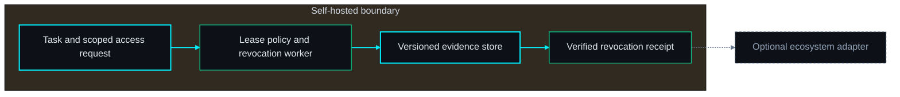
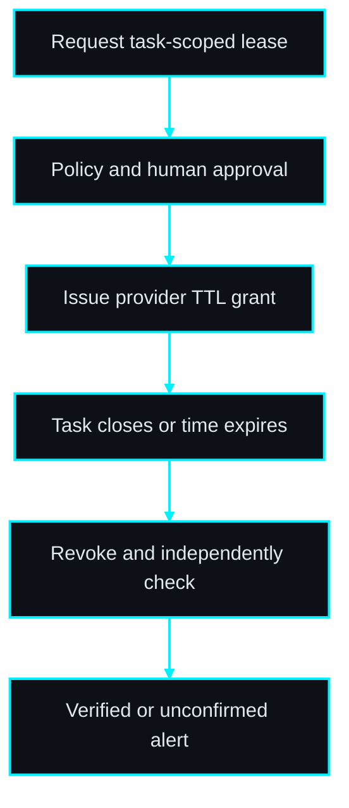
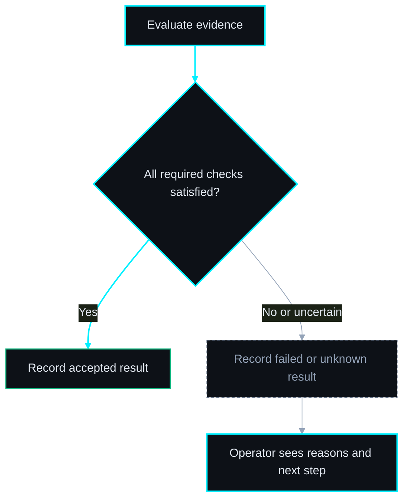

# AccessLease diagram pack

Status: proposed topology for autonomous PRD drafting; not approved for implementation.

#### ◇ Diagram — Architecture
*The core works independently; adapters are optional.*

> **THE POINT:** The core works independently; adapters are optional.

#### ◇ Diagram — Workflow
*Persist evidence at each boundary; unresolved outcomes remain visible.*

> **THE POINT:** Persist evidence at each boundary; unresolved outcomes remain visible.

#### ◇ Diagram — Acceptance decision
*Completion and acceptance are separate; uncertainty cannot become success.*

> **THE POINT:** Completion and acceptance are separate; uncertainty cannot become success.

## Proposed decisions

Select a provider with native TTL, narrow scopes and revocation verification; decide the acceptable residual-access window before a live pilot.

## Risk flags

Provider TTL and revocation semantics differ; cached access may outlive a grant. The chosen provider contract must define and test the maximum residual-access window.
